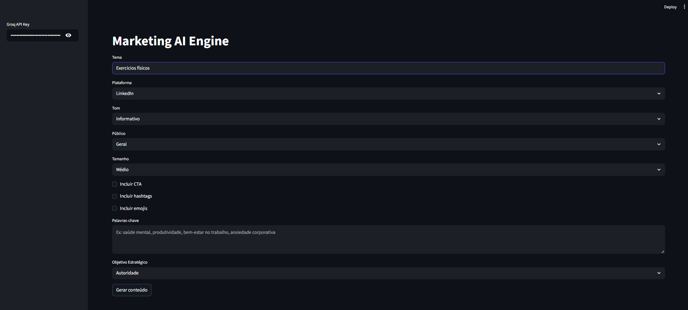

# Marketing AI Engine

Motor estratégico de geração de conteúdo com arquitetura modular, controle estrutural de prompt e salvaguardas de coerência causal.
---

<p align="center">
  
</p>
Deploy: [INSERIR LINK AQUI]

---

## 📌 Visão Geral

O Marketing AI Engine é uma aplicação construída em Streamlit que utiliza LLM (Groq + Llama 3.3 70B) para geração de conteúdo estratégico estruturado.

Diferente de geradores simples de texto, este projeto implementa:

- Arquitetura modular limpa
- Separação de responsabilidades (core, services, models, prompts, ui)
- Prompt coercitivo estruturado
- Controle de causalidade e precisão textual
- Objetivo estratégico configurável
- Integração organizada com LLM via LangChain

O foco não é apenas gerar texto, mas estruturar raciocínio estratégico dentro de uma arquitetura organizada.

---

## 🏗️ Arquitetura do Projeto

```
marketing-ai-engine/
├── .gitignore
├── .env
├── .venv/                 (não versionado)
├── requirements.txt
├── README.md
└── src/
    ├── app.py
    ├── core/
    │   ├── __init__.py
    │   └── config.py
    ├── services/
    │   ├── __init__.py
    │   └── llm_service.py
    ├── prompts/
    │   ├── __init__.py
    │   └── content_prompt.py
    ├── models/
    │   ├── __init__.py
    │   └── request_model.py
    └── ui/
        ├── __init__.py
        └── interface.py
```

### Camadas

- core/ → Configuração e validação de ambiente
- services/ → Integração com LLM e orquestração
- prompts/ → Engenharia estruturada de geração
- models/ → Validação com Pydantic
- ui/ → Interface Streamlit

Essa separação permite escalabilidade futura (multi-agente, modo campanha, etc).

---

## 🧠 Engenharia de Prompt

O sistema utiliza:

- System prompt com controle de:
  - Estrutura obrigatória em Markdown
  - Técnicas de persuasão (AIDA, PAS)
  - Controle de causalidade
  - Restrição de afirmações imprecisas

- Prompt estruturado com:
  - Objetivo estratégico
  - Palavra-chave principal
  - Subtítulos coercitivos
  - Regras de densidade informativa

Isso reduz respostas superficiais e melhora consistência.

---

## 🎯 Funcionalidades

- Seleção de objetivo estratégico:
  - Autoridade
  - Conversão
  - Engajamento
  - Educação de Mercado

- Integração de palavras-chave
- Estrutura obrigatória do conteúdo
- Controle de tom
- Geração para múltiplas plataformas

---

## ⚙️ Stack Tecnológica

- Python 3.x
- Streamlit
- LangChain
- Groq API
- Pydantic
- python-dotenv

---
## 🚀 Como Executar Localmente


### 1️⃣ Clonar o repositório

```bash
git clone https://github.com/SEU_REPOSITORIO.git
cd marketing-ai-engine
```

### 2️⃣ Criar ambiente virtual

```bash
python -m venv .venv
```

### 3️⃣ Ativar o ambiente

**Linux / Mac:**

```bash
source .venv/bin/activate
```

**Windows:**

```bash
.venv\Scripts\activate
```

### 4️⃣ Instalar dependências

```bash
pip install -r requirements.txt
```

### 5️⃣ Executar aplicação

```bash
streamlit run src/app.py
```

---

## 🔑 Variável de Ambiente

Defina sua variável de ambiente:

```bash
GROQ_API_KEY=your_api_key_here
```

Ou utilize o campo de input na sidebar da aplicação.

---

## 🧪 Objetivo do Projeto

Este projeto foi desenvolvido como laboratório de arquitetura LLM com foco em:

- Engenharia de prompt estruturada
- Controle de alucinação textual
- Separação clara de camadas
- Produção de aplicação deployável
- Estrutura escalável para evolução futura

Não é apenas um gerador de texto, mas um estudo aplicado de integração LLM com arquitetura organizada.

---

## 📌 Próximos Passos (Roadmap)

- Separação Estratégia → Execução
- Modo campanha multi-conteúdo
- Memória de marca
- Validação factual externa
- Perfil multi-especialista

---

<p align="center">
  <a href="https://rodrigo-rrc.github.io/Projetos_IA/" target="_blank">
    
  </a>
</p>

## 👤 Autor

Rodrigo Ribeiro  
Ciência de Dados | Arquitetura LLM | Automação Inteligente
